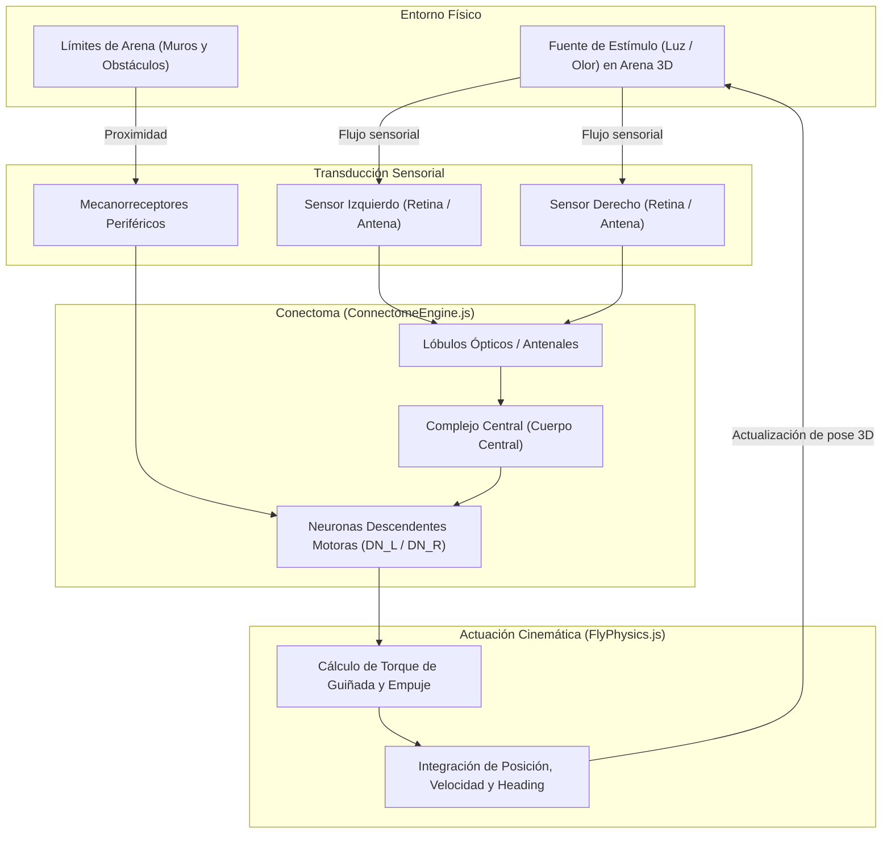
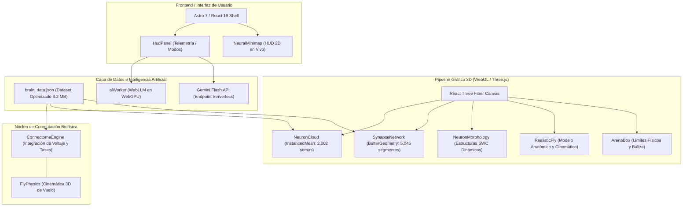

# NeuroLab 3D: Simulador Biofísico y Explorador del Conectoma de *Drosophila melanogaster*

[](https://astro.build)
[](https://threejs.org)
[](https://react.dev)
[](https://tailwindcss.com)
[](https://www.w3.org/TR/webgpu/)
[](https://flywire.ai)
[](LICENSE)
[](CONTRIBUTING.md)
[](SECURITY.md)

Plataforma web de **neurociencia computacional interactiva** y **cognición corporizada (*Embodied Cognition*)** que integra el conectoma cerebral completo a escala nanométrica de la mosca de la fruta hembra (*Drosophila melanogaster*, consorcio internacional FlyWire / Universidad de Princeton). 

El sistema ejecuta una **simulación biofísica continua a 60 FPS en el navegador**, donde la dinámica de vuelo y navegación espacial tridimensional del insecto emerge de forma no guionada (*unscripted*) a partir del procesamiento sensorial en su red neuronal biológica real.

---

## 📌 Tabla de Contenidos

- [1. Fundamento Científico y Neurobiológico](#1-fundamento-científico-y-neurobiológico)
  - [1.1 Origen y Rigor de los Datos (FlyWire / FAFB)](#11-origen-y-rigor-de-los-datos-flywire--fafb)
  - [1.2 Topología y Neurotransmisores](#12-topología-y-neurotransmisores)
  - [1.3 Reconstrucción Morfológica SWC](#13-reconstrucción-morfológica-swc)
  - [1.4 Sistema de Coordenadas Anatómicas](#14-sistema-de-coordenadas-anatómicas)
- [2. Arquitectura de Simulación Biofísica (Embodied Connectome)](#2-arquitectura-de-simulación-biofísica-embodied-connectome)
  - [2.1 Bucle Cerrado de Percepción-Acción](#21-bucle-cerrado-de-percepción-acción)
  - [2.2 Transducción Sensorial y Dinámica de Tasas](#22-transducción-sensorial-y-dinámica-de-tasas)
  - [2.3 Decodificación Motora y Aerodinámica 3D](#23-decodificación-motora-y-aerodinámica-3d)
- [3. Arquitectura del Sistema e Ingeniería de Software](#3-arquitectura-del-sistema-e-ingeniería-de-software)
  - [3.1 Diagrama de Componentes](#31-diagrama-de-componentes)
  - [3.2 Optimización Gráfica y Renderizado GPU](#32-optimización-gráfica-y-renderizado-gpu)
  - [3.3 Inferencia de Inteligencia Artificial Heterogénea](#33-inferencia-de-inteligencia-artificial-heterogénea)
- [4. Estructura del Repositorio](#4-estructura-del-repositorio)
- [5. Instalación y Puesta en Marcha](#5-instalación-y-puesta-en-marcha)
- [6. Modos de Operación](#6-modos-de-operación)
- [7. Referencias Científicas](#7-referencias-científicas)
- [8. Licencia, Contribución y Seguridad](#8-licencia-contribución-y-seguridad)

---

## 1. Fundamento Científico y Neurobiológico

### 1.1 Origen y Rigor de los Datos (FlyWire / FAFB)

El sistema opera bajo una estricta política de **cero datos sintéticos**. Todo elemento anatómico y funcional proviene del consorcio **FlyWire** y del dataset de Microscopía Electrónica de Sección en Serie (*Full Adult Fly Brain*, FAFB):
- **2,002 neuronas somáticas** indexadas con IDs globales de FlyWire, distribuidas en todos los neuropilos primarios.
- **5,045 conexiones sinápticas** reales verificadas, con conteos sinápticos directos (*weight*) y asignaciones probabilísticas de identidad sináptica.

### 1.2 Topología y Neurotransmisores

Cada sinapsis modelada incorpora su perfil de neurotransmisor predominante, estableciendo la polaridad electrofisiológica del circuito:

| Neurotransmisor | Código | Función Fisiológica Primaria | Polaridad Sináptica |
| :--- | :---: | :--- | :---: |
| **Acetilcolina** | `ACH` | Transmisión sensorial rápida e interneuronas excitatorias | **Excitatoria ($+$)** |
| **GABA** | `GABA` | Inhibición lateral, control de ganancia y sincronización | **Inhibitoria ($-$)** |
| **Glutamato** | `GLUT` | Circuitos motores, uniones neuromusculares e interneuronas | **Excitatoria / Moduladora** |
| **Dopamina** | `DA` | Aprendizaje asociativo por refuerzo y modulación de alerta | **Neuromoduladora** |
| **Serotonina** | `SER` | Regulación de ritmos de locomoción y estados internos | **Neuromoduladora** |
| **Octopamina** | `OCT` | Análogo de noradrenalina: respuesta de escape y agresión | **Neuromoduladora** |

### 1.3 Reconstrucción Morfológica SWC

Para neuronas de proyección de alta relevancia funcional (células Kenyon del cuerpo pedunculado, neuronas en cuña de navegación espacial en el complejo central), se integran reconstrucciones de esqueleto 3D en formato estándar **SWC** (`sk_lod1_783_healed`). Esto permite visualizar la microtopología real de axones y dendritas sin aproximaciones esféricas simplistas.

### 1.4 Sistema de Coordenadas Anatómicas

Las coordenadas micrométricas de microscopía electrónica fueron normalizadas respetando los ejes anatómicos biológicos de *Drosophila*:
- **Eje Dorsal (+Y) / Ventral (-Y)**: Orientación vertical desde el cuerpo pedunculado hasta el ganglio subesofágico.
- **Eje Anterior (+Z) / Posterior (-Z)**: Proyección frontal hacia las antenas y ojos compuestos.
- **Eje Lateral ($\pm$X)**: Separación hemisférica bilateral simétrica en lóbulos ópticos.

---

## 2. Arquitectura de Simulación Biofísica (Embodied Connectome)

### 2.1 Bucle Cerrado de Percepción-Acción

La locomoción de la mosca no está pre-animada. Un motor continuo a 60 Hz implementa el ciclo de control neuroetológico:



### 2.2 Transducción Sensorial y Dinámica de Tasas

En cada paso de integración ($dt = 16.6\text{ ms}$):
1. **Flujo Sensorial Bilateral:** Se calcula el gradiente espacial incidente sobre los sensores cefálicos:
   $$\Delta I = I_{\text{izq}} - I_{\text{der}}$$
2. **Propagación en Red (Leaky Rate Dynamics):** Las neuronas sensoriales inyectan corriente al conectoma. Cada neurona actualiza su nivel de excitación $a_i \in [0, 1]$ según:
   $$\tau \frac{da_i}{dt} = -a_i + \sigma\left( I_i^{\text{ext}} + \sum_{j} w_{ji} \cdot a_j \right)$$
   donde $w_{ji} > 0$ para sinapsis colinérgicas/glutamatérgicas y $w_{ji} < 0$ para sinapsis GABAérgicas.

### 2.3 Decodificación Motora y Aerodinámica 3D

El vector resultante de las neuronas motoras descendentes bilaterales ($DN_{\text{izq}}, DN_{\text{der}}$) gobierna los grados de libertad del vuelo:
- **Torque de Guiñada (*Yaw Torque*):** Proporcional a la asimetría motora:
  $$\tau_{\text{yaw}} = k_{\text{turn}} \cdot (DN_{\text{izq}} - DN_{\text{der}})$$
- **Empuje Frontal (*Forward Thrust*):** Modulado por la suma de activación motora y el estado de alerta general.
- **Evasión de Muros (*Wall Clearance*):** La detección mecanosensorial cercana a los límites de la arena ($80 \times 45 \times 80\text{ u}$) desencadena un reflejo viscoelástico de repulsión que invierte suavemente la componente normal del vector de velocidad, eliminando el atrapamiento en esquinas.

---

## 3. Arquitectura del Sistema e Ingeniería de Software

### 3.1 Diagrama de Componentes



### 3.2 Optimización Gráfica y Renderizado GPU

- **Instancing Masivo (`THREE.InstancedMesh`):** Las 2,002 neuronas se procesan en un único llamado de dibujado (*single draw call*). La actualización de matrices de escala y buffers de color por activación ocurre en tiempo de frame sin alterar el árbol del DOM.
- **Segmentos Sinápticos con Mezcla Aditiva:** Las 5,045 conexiones se dibujan mediante un único `THREE.LineSegments` con `AdditiveBlending`, permitiendo simular visualmente la propagación de impulsos bioeléctricos sin colapsar el pipeline de rasterización.
- **Aislamiento en Vite/Astro:** Se configuraron exclusiones explícitas de optimización de dependencias para aislar colecciones masivas de archivos de microscopía y datasets binarios, garantizando un arranque en frío inferior a 1 segundo.

### 3.3 Inferencia de Inteligencia Artificial Heterogénea

El módulo de análisis neurocientífico provee diagnósticos funcionales para cualquier neurona seleccionada mediante una arquitectura en capas:
1. **WebGPU Local (`@mlc-ai/web-llm`):** Ejecuta un modelo cuántico local en un Web Worker dedicado en navegadores compatibles, con latencia nula y privacidad absoluta.
2. **Nube Serverless Fallback (`@google/genai`):** Emplea endpoints optimizados con modelos Gemini Flash para navegadores sin aceleración WebGPU.
3. **Generador Heurístico Local:** Motor determinista basado en el perfil neuroquímico y neuropilo anatómico como respaldo permanente sin conexión.

---

## 4. Estructura del Repositorio

```text
├── public/
│   ├── data/
│   │   └── brain_data.json       # Conectoma normalizado (2,002 neuronas, 5,045 sinapsis, 30 SWCs)
│   └── favicon.svg
├── src/
│   ├── components/
│   │   ├── ArenaBox.jsx           # Arena 3D de vuelo, baliza de estímulo y trayectoria
│   │   ├── BrainScene.jsx         # Orquestador del Canvas Three.js y bucle de simulación
│   │   ├── HudPanel.jsx           # HUD dual (Microscopio vs Telemetría de Vuelo)
│   │   ├── NeuralMinimap.jsx      # Minimapa superior izquierdo con brújula y flujo sensorial
│   │   ├── NeuronCloud.jsx        # Renderizado instanciado de somas neuronales en GPU
│   │   ├── NeuronMorphology.jsx   # Arborizaciones dendríticas y axonales SWC
│   │   ├── RealisticFly.jsx       # Cutícula, ojos facetados, alas con venación y apéndices
│   │   ├── SynapseNetwork.jsx     # Grafo de líneas sinápticas con código de neurotransmisores
│   │   └── NeuroLabViewer.jsx     # Coordinador principal de estado y vistas
│   ├── data/
│   │   └── neurons.js             # Mapeos de circuitos de estímulo, regiones y neurotransmisores
│   ├── hooks/
│   │   ├── useAIAnalysis.js       # Hook de integración IA (WebGPU / API / Local)
│   │   └── useStimulusSimulation.js # Hook de activación sensorial en microscopio
│   ├── simulation/
│   │   ├── ConnectomeEngine.js    # Motor biológico a 60 Hz (integración sináptica)
│   │   └── FlyPhysics.js          # Cinemática, torque de guiñada y colisiones en arena
│   ├── utils/
│   │   └── neuronColors.js        # Paletas científicas por neurotransmisor y neuropilo
│   ├── workers/
│   │   └── aiWorker.js            # Worker de inferencia WebLLM en segundo plano
│   └── pages/
│       ├── index.astro            # Página principal de la aplicación
│       └── api/analisis-ia.js     # Endpoint serverless para análisis neuronal
├── generate_real_data.cjs         # Script generador del dataset optimizado desde FlyWire FAFB
├── astro.config.mjs               # Configuración de Astro, Tailwind v4 y optimizaciones Vite
├── package.json                   # Dependencias y scripts del proyecto
└── README.md                      # Documentación técnica y científica del proyecto
```

---

## 5. Instalación y Puesta en Marcha

### Requisitos Previos
- **Node.js**: $\ge 22.12.0$
- **Administrador de paquetes**: `npm`, `pnpm` o `yarn`
- **Navegador**: Compatible con WebGL 2.0 (Chrome, Firefox, Safari o Edge moderno). Para inferencia IA local, se recomienda soporte de WebGPU.

### Instalación

1. Clonar el repositorio:
   ```bash
   git clone https://github.com/AngelOlivares842/flywire.git
   cd flywire
   ```

2. Instalar dependencias:
   ```bash
   npm install
   ```

3. Iniciar el servidor de desarrollo:
   ```bash
   npm run dev
   ```
   La aplicación estará disponible en `http://localhost:4321/`.

4. Compilar para producción:
   ```bash
   npm run build
   npm run preview
   ```

---

## 6. Modos de Operación

### 🔬 1. Modo Microscopio Neuroanatómico
- **Exploración Celular:** Navegación orbital alrededor del encéfalo a escala $1.0\times$.
- **Inspección de Circuitos:** Selección individual de somas con exposición de metadatos, conexiones entrantes/salientes y perfil de neurotransmisores.
- **Disección Anatómica:** Aislamiento dinámico por neuropilo (Lóbulo Óptico, Complejo Central, Cuerpo Pedunculado, etc.) o por tipo de neurotransmisor.
- **Árboles Morfológicos 3D:** Activación de filamentos SWC que revelan el trayecto axonal y el árbol dendrítico real.
- **Tours Guiados:** Recorridos cinemáticos pedagógicos por las estructuras clave del sistema nervioso.

### 🪰 2. Modo Cámara de Vuelo (Arena 3D)
- **Navegación Autónoma:** La mosca se ubica dentro de un entorno tridimensional delimitado ($80 \times 45 \times 80\text{ u}$) a escala $0.28\times$.
- **Estimulación Sensorial:** Reubicación interactiva de fuentes lumínicas o químicas que activan receptores periféricos.
- **Minimapa Neural en Tiempo Real:** Visualizador HUD que muestra la despolarización hemisférica, el ángulo relativo del vector de estímulo y el balance motor instantáneo.
- **Telemetría Sensoriomotora:** Monitoreo en vivo de la frecuencia de aleteo, torque asimétrico y balance de guiñada.

---

## 7. Referencias Científicas

1. **Dorkenwald, S., et al.** (2024). *Neuronal wiring diagram of an adult brain*. **Nature**, 634, 124–138. [doi:10.1038/s41586-024-07558-y](https://doi.org/10.1038/s41586-024-07558-y).
2. **Schlegel, P., et al.** (2024). *A consensus cell type atlas of the adult Drosophila melanogaster brain*. **Nature**, 634, 139–152. [doi:10.1038/s41586-024-07686-5](https://doi.org/10.1038/s41586-024-07686-5).
3. **FlyWire Consortium:** [https://flywire.ai](https://flywire.ai) — Plataforma comunitaria de prueba de lectura y anotación del conectoma FAFB.
4. **Zheng, Z., et al.** (2018). *A Complete Electron Microscopy Volume of the Adult Drosophila Brain*. **Cell**, 174(3), 730–743. [doi:10.1016/j.cell.2018.06.019](https://doi.org/10.1016/j.cell.2018.06.019).

---

## 8. Licencia, Contribución y Seguridad

- **Licencia:** Distribuido bajo la [Licencia MIT](LICENSE) con nota formal de atribución científica al consorcio FlyWire.
- **Guía de Contribución:** Consulta [CONTRIBUTING.md](CONTRIBUTING.md) para conocer las pautas de código, rigor biológico y flujo de trabajo en Git.
- **Política de Seguridad:** Consulta [SECURITY.md](SECURITY.md) para detalles sobre divulgación responsable de vulnerabilidades y consideraciones de seguridad en WebGL/WebGPU.
- **Contacto:** Para consultas, colaboraciones académicas o soporte técnico: [angel.olivares.rosas2@gmail.com](mailto:angel.olivares.rosas2@gmail.com).

---

<p align="center">
  Desarrollado como proyecto de integración en <b>Neurociencia Computacional, Gemelos Digitales Biológicos y WebGL de Alto Rendimiento</b>.
</p>
